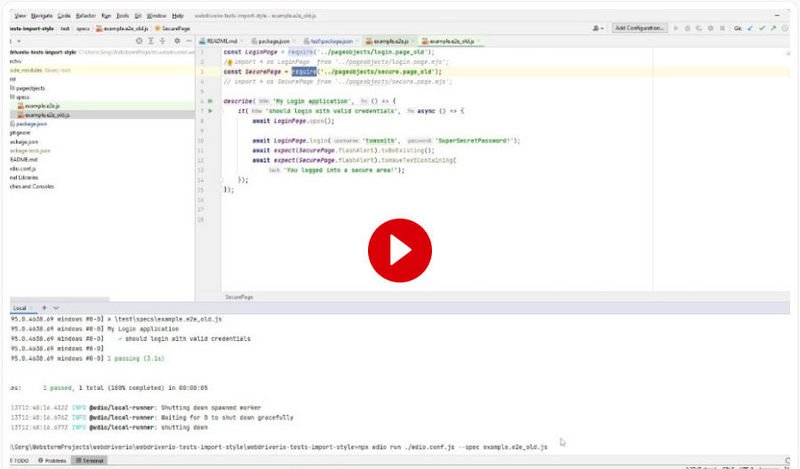

<h1>WebdriverIO tests 'import' or 'require' code style</h1>

WebdriverIO tests loading modules in the "import" or "require" code style by creating a local scope. 
Local scope is implemented by using the local test/package.json file and  
by changing test environment variable "type": "commonjs" to "type": "module" in that file.

The example.e2e_old.js file uses the 'require' code style without any type designation (default)  
or with a designation "type": "commonjs"  in the test/package.json file.  
The example.e2e.js file uses the 'import' code style by designating the value of environment variable "type":"module"  in the same test/package.json file.
  
In the next video you can see how it works in the described modes

